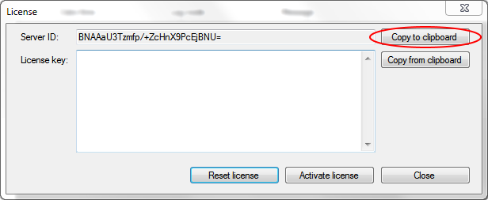
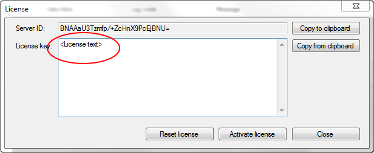
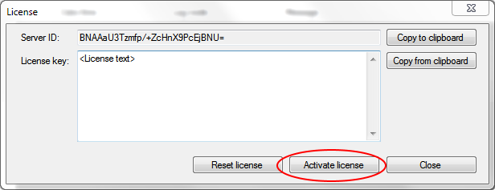

## 1 Introduction

After you have installed the Mendix software on your on-premises server and have deployed your first app (for details, see [Deploying Mendix on Microsoft Windows](deploy-mendix-on-microsoft-windows)), it is time to activate your license. This how-to will guide you through this process.  

**This how-to will teach you how to do the following:**

* Activate a Mendix license on a Microsoft Windows server

## 2 Prerequisites

Before starting with this how-to, make sure you have completed the following prerequisites:

* To activate a Mendix instance on-premises you need an on-premises license (call your Customer Success Manager for more information)
* Install Mendix on your Microsoft Windows server (for more information, see [Deploying Mendix on Microsoft Windows](deploy-mendix-on-microsoft-windows))
* Be registered as the technical contact for the license
    * This is usually done in the license request process
    * If you are not the technical contact, ask him or her to follow this how-to to activate the license
* Have your MxID and password ready
* Have login access and access to the Mendix Service Console on the server

## 3 Retrieve the Server ID

In this section, you will retrieve the server ID from your Mendix server, which is used in the license activation process. These steps should be executed on the Microsoft Windows server.

1. Start the Mendix Service Console.
2. Select your app in the overview on the left side of the console.
    
3. The app needs to be running in order for you to be able to activate the license. If the app is not running, click **Start service** to start the app.
4.  Click **Advanced** and select the **Show or add license...** option.
     
5. Next to **Server ID**, click **Copy to clipboard**.
     

## 4 Retrieve the License Key by Submitting a Ticket

In this section, you will submit your server ID in the Mendix support portal to request a license key for your server.

1. Open your browser and navigate to [https://support.mendix.com](https://support.mendix.com).
2. Create a new ticket:
    * For a new app, use the **New App** template
    * For an existing app, use the **Key Change request (on-premises)** template
3. Mendix support will use the supplied server ID to generate a license key for your server.

## 5 Insert the License Key on the Server

In this section, you will enter the license key into the Mendix server, thus completing the license activation process.

1. Return to the Mendix Service Console **License** dialog box (as described in [3 Retrieve the Server ID](#3RetrievetheServerID)).
     
2. Paste your license key into the **License key** text box.
     
3.  Click **Activate license**.
     
4.  Congratulations! Your license has been activated.

## 6 Related Content

*   [Setting up the Database User](setting-up-the-database-user)
*   [Troubleshooting](troubleshooting)
*   [Restoring a SQL Server Database](restoring-a-sql-server-database)
*   [Troubleshooting SQL Server](troubleshooting-sql-server)
*   [Mendix SQL Maintenance Plans](mendix-sql-maintenance-plans)
*   [Setting Up a New SQL Server Database](setting-up-a-new-sql-server-database)
*   [Setting Up a SQL Server User](setting-up-a-sql-server-user)
