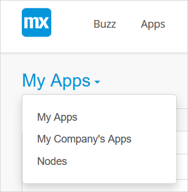
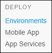
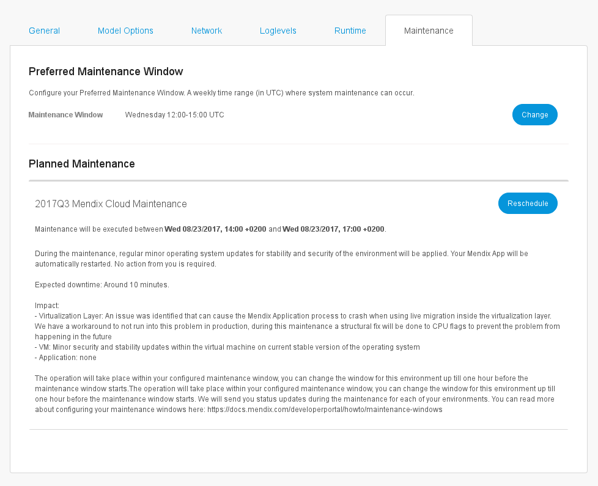

In the Mendix Cloud you can define a Maintenance Window for all your applications in the Professional and Enterprise plans.

**After completing this how-to you will know:**

*   How to configure a maintenance window

## 1 Preparation

Before you can start with this how-to, please make sure you have completed the following prerequisites.

*   Have a Mendix Cloud application where you have transport, monitor, or backup access (for more information, see [Security - Node Permissions](/developerportal/deploy/node-permissions))

## 2 Maintenance Operations

In the Mendix Cloud you can configure a weekly time range where system maintenance can occur. Whenever we have planned operations, these will be executed within the time window of your preference. Naturally we will always inform you upfront on any upcoming maintenance operations in accordance with your SLA.

### 2.1 Maintenance Window

Your "Preferred Maintenance Windows" is a weekly time range where system maintenance can occur.

### 2.2 Planned Maintenance

"Planned Maintenance" is a maintenance operation that will be executed within your configured maintenance window.

## 3 Configuring the Maintenance Window for your application

1. Go to the [Developer Portal](http://home.mendix.com) and click **Apps** in the top navigation panel.
2. Click **My Apps** and select **Nodes**.

    

3. Select the node that you want to configure by clicking **Details**.
4. Click **Environments** under the **Deploy** category:

        

3. Select the node of the environment that you want to configure:

    

4. Click **Details** for the environment you want to configure:

    

5. Go to the **Maintenance** tab:

    

    Here you can configure your preferred maintenance window. Transport rights for this environment are required. 

6. Click **Change** to modify the preferred maintenance window of your environment.

    {}All windows are defined in UTC time format.  Remember to convert to UTC from your local time.{}

{}

When a maintenance operation is planned, it will show up under **Planned Maintenance**. By default it will be planned in your preferred maintenance window. You can override the maintenance window of a specific maintenance operation by clicking **Reschedule**.

{}

## 4 Related Content

* [Alerts](/developerportal/operate/monitoring-application-health)
* [Application Trends in Mendix Cloud v3](/developerportal/operate/trends)
* [Application Trends in Mendix Cloud v4](/developerportal/operate/trends-v4)
* [How to Manage Company & App Roles](/developerportal/company-app-roles/manage-roles)
* [How to Receive Environment Status Alerts](/developerportal/operate/receive-alerts)
* [Mendix Cloud](mendix-cloud-deploy)
* [Mendix Cloud v4 - FAQ](mxcloudv4)
* [Company & App Roles](/developerportal/company-app-roles/index)
* [Security - Node Permissions](/developerportal/deploy/node-permissions) 
* [Technical Contact](/developerportal/company-app-roles/technical-contact)
